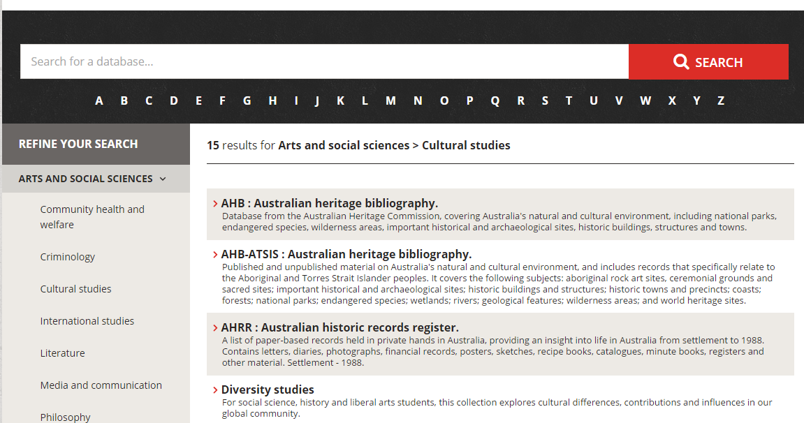
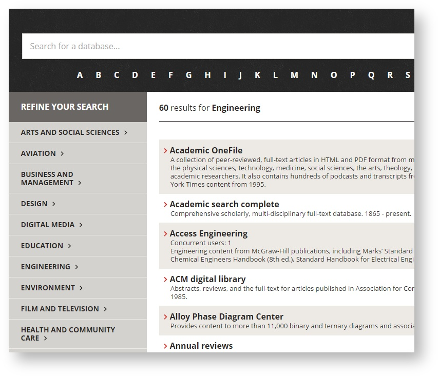
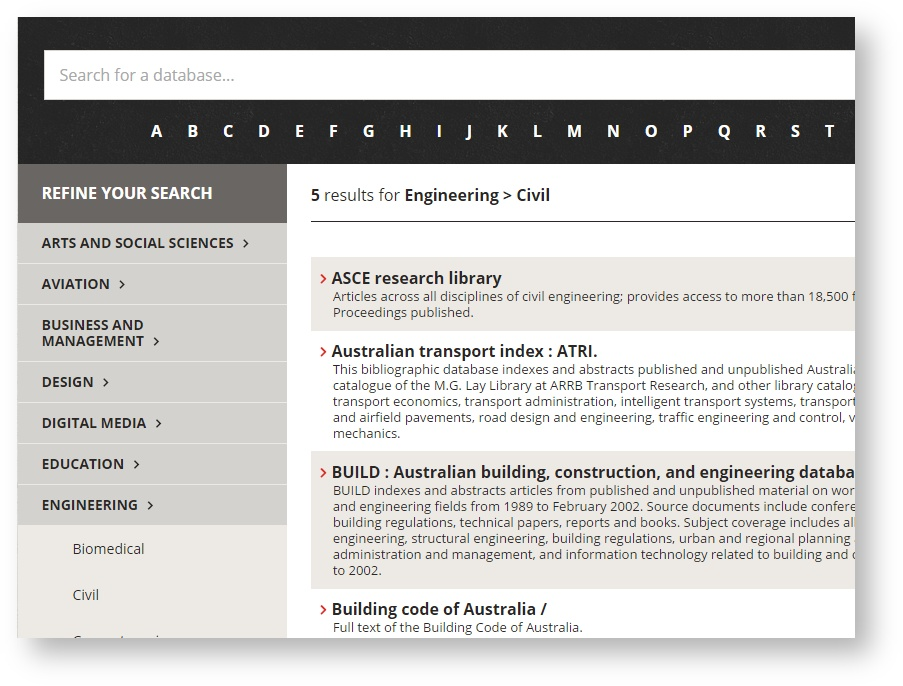
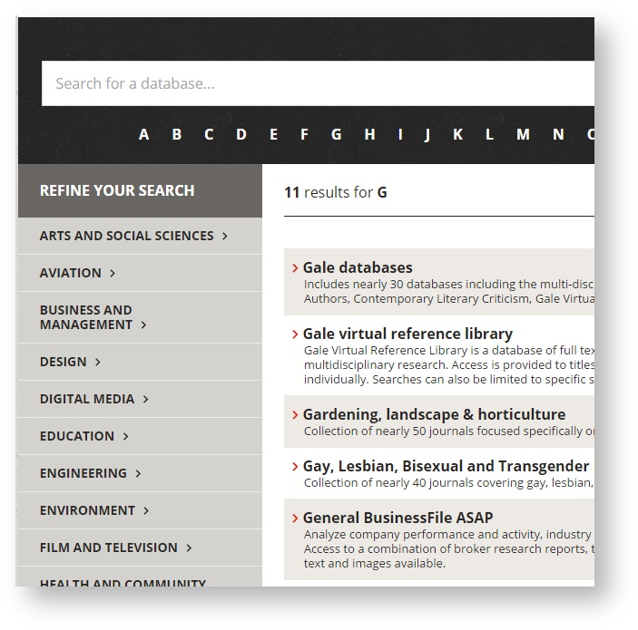
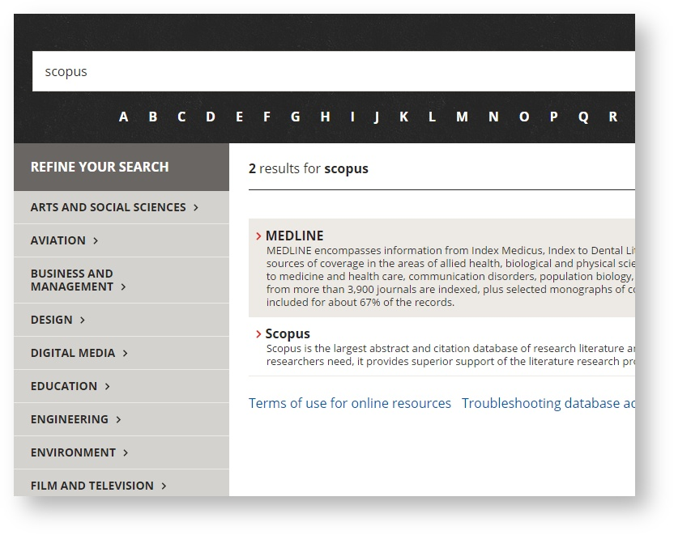
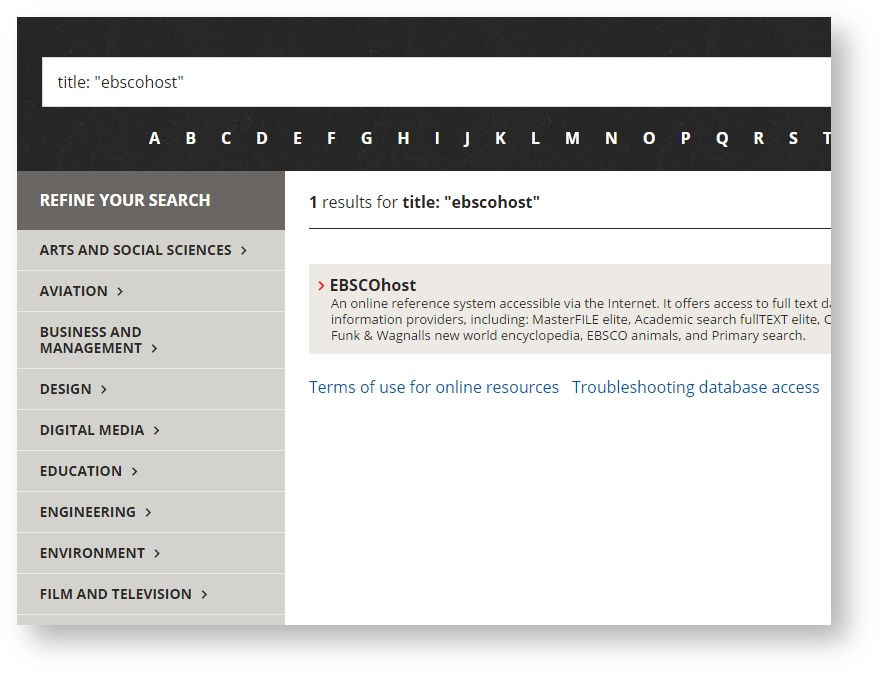
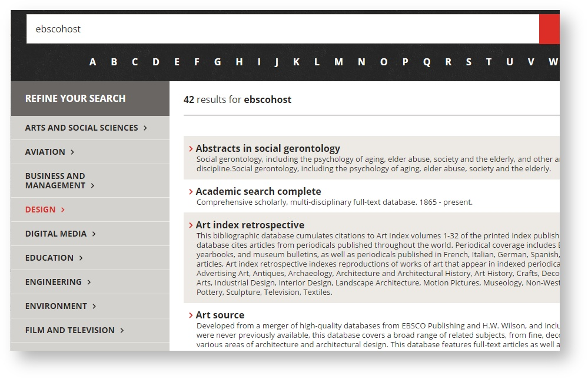
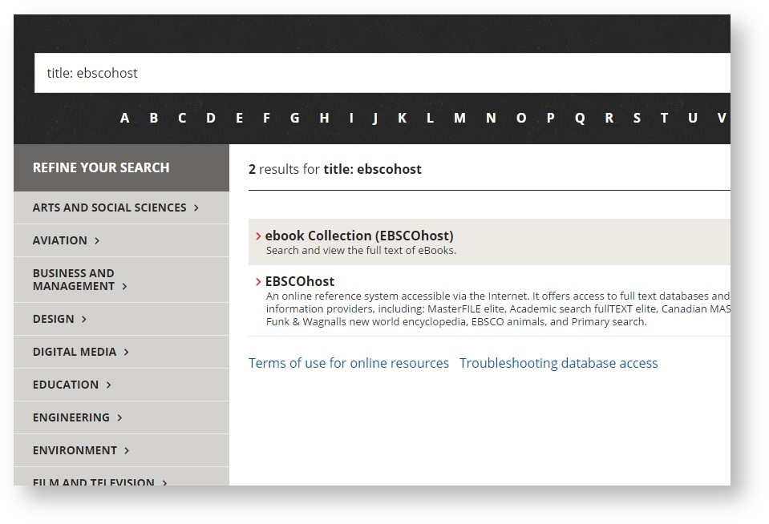
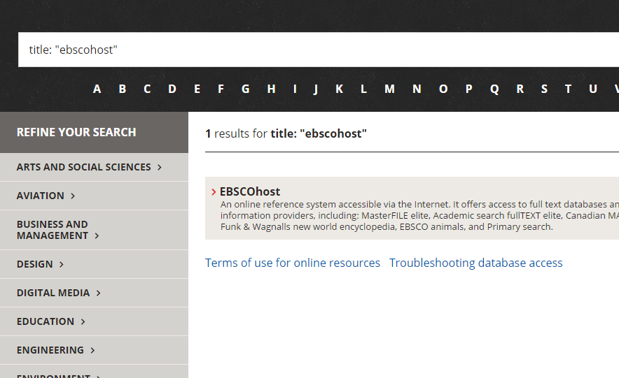

# AZ Databases
AZ Databases provides a modern database discovery application for University libraries that is based on the ExLibris Alma APIs

Free/Open source alternative to:
* ExLibris MetaLibs - Find a Database feature
* SpringShares Libguides (if using it just to store,list and group databases)
* ExLibris Primo - Find Database feature



Live example: [http://www.swinburne.edu.au/library/search/databases/#/](http://www.swinburne.edu.au/library/search/databases/#/)

# Features

* Completely based on ExLirbis Alma APIs
 *  All data is stored in Alma as Marc records, there is no duplcation of data or normalisation 
* Filtering by category and sub-category (Such and 'Engineering' and then 'Mechanical' or 'Electricial')
* Modern design
 * Responsive
 * Single page javascript based applicaiton
 * No page refreshes anywhere
 * Infinite scrolling (no paginatioon)
* Letter filters - find databases starting with selected letter
* [Permanent links](#permanent-links) for everything
* Searches across most of the MARC fields in the Alma records

# Motivation

Swinburne had been using a largely unchanged collection of static HTML pages to list our available databases by A-Z for almost 20 years. This very basically served its purpose but issues with inconsistent data, double handling (saved in html and also in the library system), no dyanmaic content or filters by area or subject, and no real search.

Following a survey or other University librarys AZ systems (refer links below) we decided to create a new AZ system similar to UTSs but based 100% on the ExLirbis Alma APIs and released as open-source.

## Examples of other AZ Database system

* Swinburnes previous AZ (static html) http://web.archive.org/web/20140923101818/http://www.swinburne.edu.au/lib/database/databaselist_a.htm
* UTS (custom python app) http://www.lib.uts.edu.au/databases/search_databases.py
* Deakin (custom php app) http://www.deakin.edu.au/library/a-z/databases.php
* Monash (libguides) http://guides.lib.monash.edu/subject-databases
* Harvard (ExLibris Metalib) http://e-research.lib.harvard.edu/V?func=find-db-1
* Princeton (Solr and Drupal) http://library.princeton.edu/research/databases

# Documentation

* [Installation](#installation)
* [Permanent links](#permanent-links)
* [Title searching](#title-searching)
* [Alma configuration](#alma-configuration)
* [MARC field usage](#marc-fields)
* [Server API Documentation](#server-api-documentation)
* [Frequently Asked Questions](#faq)

## Installation

AZ Databases consists of 3 mains sections

* The ExLibris Alma
* A PHP/MySQL server
* A javascript based client

### ExLibris Alma

The Alma setup is detailed in these sections:

* [Alma configuration](#alma-configuration)
* [MARC field usage](#marc-fields)

### PHP/MySQL Server

#### PHP
The server component on AZ Databases uses the Laravel PHP framework. This requries a server with PHP 5.5 and MySQL.

To install this component, copy the 'server' folder onto your webserver

Copy the file '.env.example' and rename it as '.env'. This file contains the MySQL database connection details, fill in the below listed fields with the appropraite data fro your environment


```
DB_HOST=localhost
DB_DATABASE=homestead
DB_USERNAME=homestead
DB_PASSWORD=secret
```


TODO: MORE DETAILS TO COME

#### MySQL

Create a blank database on your MySQL server and record the details in the above listed '.env' file

AZ Databases will auto create the correct database tables when it imports data from the Alma API.

Note: The PHP app will import that Databases info fro the Alma API and store in in MySQL in a format suitable for the front end client - so can easily do Cateigy and Sub-category filtering, fullt ext searching etc..

Each time the import runs it fully deletes the contents of the MySQL database and does a full import from Alma.  

The data in MySQL is jsut a temp store for the Alma data. No edits are done to the MySQL data - all changes are dont in Alma.

### Client

Edit the 'index.html' file in the 'client' folder and change the URL for 'AZ_server' to be the path to the PHP app/server that was setup in the previous step

```
    /* AZ Configuration */
    var AZ_server = 'http://www.swinburne.edu.au/lib/tools/az_server/public';
```    

Copy the 'client' folder to a webserver and open the directory up in your web-browser

Done :)

## Permanent links

In AZ Database all pages and actioons are permanent URLs

This is so its easy to email (or embed) links to specific parts of AZ Databases.

After you have done the click (ie. on a Letter) or action (ie. search or area refinement) to get to the page you want - just copy the URL in the browser and it will work as a permament URL

Below are examples of all the different linking types in AZ Databases

### Category

Links to an Category (such as Engineering)
http://www.swinburne.edu.au/library/search/databases/#/area/engineering



### Sub-category
Linking to an Sub-Category (such as Engineering > Civil)
http://www.swinburne.edu.au/library/search/databases/#/area/engineering/subject/civil

 
### Letters

Links to Letters (such as G)
http://www.swinburne.edu.au/library/search/databases/#/letter/G



## Search

Linking to search results (such as scopus)
http://www.swinburne.edu.au/library/search/databases/#/search/scopus


### Title search

Linking to title searches (such as scopus)
http://www.swinburne.edu.au/library/search/databases/#/search/title%3Ascopus


### Exact title search

Linking to exact title search (such as "ebscohost")
http://www.swinburne.edu.au/library/search/databases/#/search/title%3A%20%22ebscohost%22



## Title searching

How in the new AZ databases do you link to just 1 specific title?

A search for ebscohost in AZ Databases, returns all 42 ebscohost databases in Alma
note: a general search searches the url, title, description, alt title and other marc fields
refer link and screenshot below

http://www.swinburne.edu.au/library/search/databases/#/search/ebscohost



By adding title: to the start of the search query we can limit to a title search for ebscohost, this returns the 2 database with ebscohost in the title
refer link and screenshot below
http://www.swinburne.edu.au/library/search/databases/#/search/title%3Aebscohost



By putting quotes around the search term we can limit to an exact title search, this returns just 1 result - which is the main ebscohost database
refer link and screenshot below
http://www.swinburne.edu.au/library/search/databases/#/search/title%3A%20%22ebscohost%22


 
By using title searches in AZ Databases you can create links to a group or an single title.
 
## Alma configuration

## MARC fields

* 245a = title
* 246a = alt title - can be multiple
* 260a and b = place of publication and publisher
* 960a = subject - can be multiple 
 * This field defines that top level category the database will be listed in - suxh as 'Engineering'
* 960b = sub-subject - got to think about this - Swinburne defined list (A-Z Subject mapping)
*  * This field defines that second level (sub-category) the database will be listed in - such as 'Electrical'
* 650a = sub subject - can be multiple- LC headings
* 520a = description
* 500a = user limit notes
* 362a = time span
* 917a = URL

Sample record in ALMA

```
NB this record does not have an 588 or a 362 marc tag.
=LDR  03136nai  2200565 a 4500
=001  9933340611501361
=005  20150612094406.0
=006  m\\\\\\\\e\\\\\\\\
=007  cr\mnu---uuuuu
=008  120123c199u9999enkmr\d\sia\\\0\\\a2eng\d
=019  \\$a9933340611501361
=019  \\$a9933340611501361
=019  \\$a9933340611501361
=019  \\$a9933340611501361
=035  \\$a(AuCNLKIN)000048489615
=040  \\$aCLONE$beng$dVMOU
=245  00$aERIC$h[electronic resource].
=246  3\$aEducational Resources Information Center database
=260  \\$a[Cambridge, Eng.] :$bProQuest.
=310  \\$aUpdated monthly
=588  \\$aTitle from database search screen (viewed January 23, 2012)
=500  \\$aDatabase coverage: 1994 to present.
=506  \\$aRestricted to users at subscribing institutions.
=520  \\$aThis bibliographic database indexes and abstracts published and unpublished literature in the field of education. Source documents include journal articles, conference papers, government documents, theses, reports, audiovisual media, bibliographies, research reports, curriculum and teaching guides, and books.
=520  8\$aMajor areas of subject coverage include: adult, career, and vocational education; counseling and personnel services; elementary and early childhood education; education management; handicapped and gifted children; higher education; information resources; junior colleges; languages and linguistics; reading and communication skills; rural education and small schools; science; mathematics; environmental education; social studies and social science education; teacher education; tests, measurement and evaluation; and, urban education.
=538  \\$aMode of access: World Wide Web.
=550  \\$aERIC is supported by the U.S. Department of Education's Office of Educational Research and Improvement and is administered by the U.S. National Library of Education (NLE)
=580  \\$aCorresponds to two print publications: Resources in education (RIE) and, Current index to journals in education (CIJE).
=650  \0$aEducation$vIndexes.
=650  \0$aEducation$vAbstracts.
=650  \0$aEducation$vPeriodicals$vIndexes.
=650  \0$aEducation$vPeriodicals$vAbstracts.
=650  \0$aEducation$zUnited States$vIndexes.
=650  \0$aEducation$zUnited States$vAbstracts.
=650  \0$aEducation$zUnited States$vPeriodicals$vIndexes.
=650  \0$aEducation$zUnited States$vPeriodicals$vAbstracts.
=710  2\$aEducational Resources Information Center (U.S.)
=710  2\$aProQuest (Firm)
=730  02$aResources in education
=730  02$aCurrent index to journals in education
=787  0\$tResources in education$w(DLC)75655211$w(OCoLC)2241688
=787  0\$tCurrent index to journals in education$w(DLC)sc 78001463$w(OCoLC)1565633
=830  \0$aSwinburne library databases
=914  \\$aESWLD
=914  \\$aEPROQ
=917  40$ahttp://search.proquest.com/eric/socialsciences/fromDatabasesLayer?accountid=14205
=960  \\$aBusiness$bAccounting
=960  \\$aBusiness$bTaxation
=960  \\$aInformation technology$bDatabases
```

## Server API Documentation

## Frequently Asked Questions
