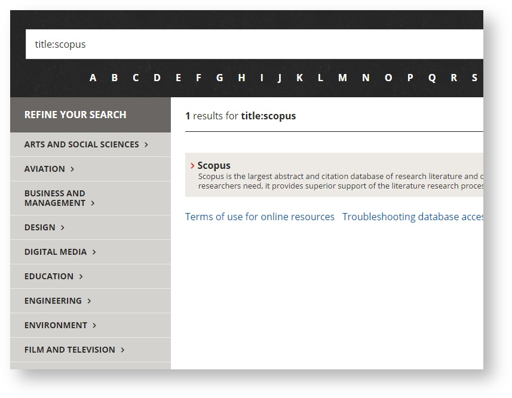

# AZ Databases
AZ Databases provides a modern database discovery application for University libraries that is based on the ExLibris Alma APIs

Live example: 

# Aim

* Completely based on ExLirbis Alma APIs
 *  All data is stored in Alma as Marc records, there is no duplcation of data or normalisation 
* Modern design
 * Responsive
 * Single page javascript based applicaiton
 * No page refreshes anywhere
 * Infinite scrolling (no paginatioon)
* [Permanent links](#permanent-links) for everything

# Motivation

Swinburne had been using a largely unchanged collection of static HTML pages to list our available databases by A-Z for almost 20 years. This very basically served its purpose but issues with inconsistent data, double handling (saved in html and also in the library system), no dyanmaic content or filters by area or subject, and no real search.

Following a survey or other University librarys AZ systems (refer links below) we decided to create a new AZ system similar to UTSs but based 100% on the ExLirbis Alma APIs

## Examples of other AZ Database system

* Swinburnes previous AZ (static html) http://web.archive.org/web/20140923101818/http://www.swinburne.edu.au/lib/database/databaselist_a.htm
* UTS (custom python app) http://www.lib.uts.edu.au/databases/search_databases.py
* Deakin (custom php app) http://www.deakin.edu.au/library/a-z/databases.php
* Monash (libguides) http://guides.lib.monash.edu/subject-databases
* Harvard (ExLibris Metalib) http://e-research.lib.harvard.edu/V?func=find-db-1
* Princeton (Solr and Drupal) http://library.princeton.edu/research/databases

# Features

* [Permanent links](#permanent-links)
* [Title searching](#title-searching)

# Usage

* [Server API Documentation](#server-api-documentation)
* [Frequently Asked Questions](#faq)

## Permanent links

In AZ Database all pages and actioons are permanent URLs

This is so its easy to email (or embed) links to specific parts of AZ Databases.

After you have done the click (ie. on a Letter) or action (ie. search or area refinement) to get to the page you want - just copy the URL in the browser and it will work as a permament URL

Below are examples of all the different linking types in AZ Databases

### Category

Links to an Category (such as Engineering)
http://www.swinburne.edu.au/library/search/databases/#/area/engineering

### Sub-category
Linking to an Sub-Category (such as Engineering > Civil)
http://www.swinburne.edu.au/library/search/databases/#/area/engineering/subject/civil

 
### Letters

Links to Letters (such as G)
http://www.swinburne.edu.au/library/search/databases/#/letter/G

## Search

Linking to search results (such as scopus)
http://www.swinburne.edu.au/library/search/databases/#/search/scopus

### Title search

Linking to title searches (such as scopus)
http://www.swinburne.edu.au/library/search/databases/#/search/title%3Ascopus

### Exact title search

Linking to exact title search (such as "ebscohost")
http://www.swinburne.edu.au/library/search/databases/#/search/title%3A%20%22ebscohost%22

## Title searching

How in the new AZ databases do you link to just 1 specific title?

A search for ebscohost in AZ Databases, returns all 42 ebscohost databases in Alma
note: a general search searches the url, title, description, alt title and other marc fields
refer link and screenshot below

http://www.swinburne.edu.au/library/search/databases/#/search/ebscohost

By adding title: to the start of the search query we can limit to a title search for ebscohost, this returns the 2 database with ebscohost in the title
refer link and screenshot below
http://www.swinburne.edu.au/library/search/databases/#/search/title%3Aebscohost

By putting quotes around the search term we can limit to an exact title search, this returns just 1 result - which is the main ebscohost database
refer link and screenshot below
http://www.swinburne.edu.au/library/search/databases/#/search/title%3A%20%22ebscohost%22

 
By using title searches in AZ Databases you can create links to a group or an single title.
 
## Server API Documentation

## Frequently Asked Questions
